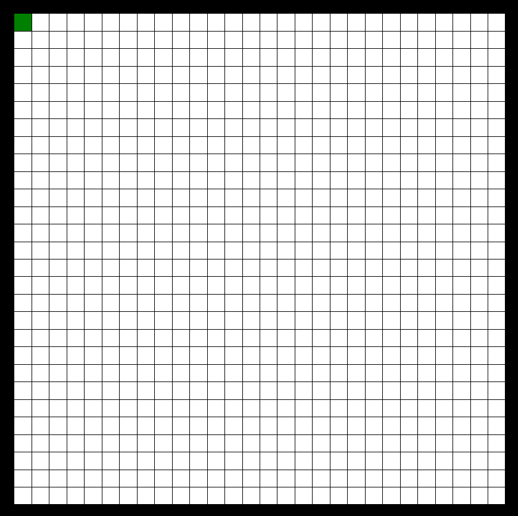
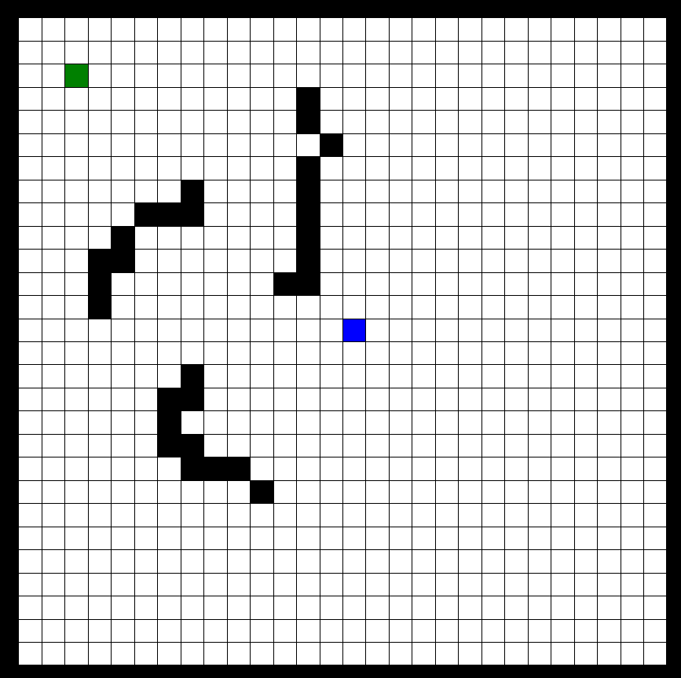

# A* Pathfinding Visualization

### What it is

The A* Pathfinding Algorithm is a pathfinding algorithm that will find the shortest path from a start point to an end point, even if there are obstacles in the way. This program will visually show the process that the pathfinding algorithm goes through when calculating the best path from the start to the end. 

When the program is first opened, it will show an empty grid with a default start point in the top left corner:

The user is then able to choose a new start point (green), an end point (blue), and any obstacles that they would like (black)

### Controls
* Press 1 and click anywhere on the grid to make a start point
* Press 2 and click anywhere on the grid to make an end point
* Press 3 and click anywhere on the grid to make a wall
* Press 4 and click on any point to delete that point
* Press enter to start the pathfinding and watch the magic happen

### Setup
This is a CMake project using Cinder for visuals, so there are some steps necessary before running this program.
* Ensure that CMake and any C++ compiler of your choice is installed (This was created using CLion)
* Download this github repo, and add it to the my-projects folder of Cinder
* Build the project using CMake, and then compile

**NOTE:** This application was only tested in Linux. Other OS's may have additional steps
